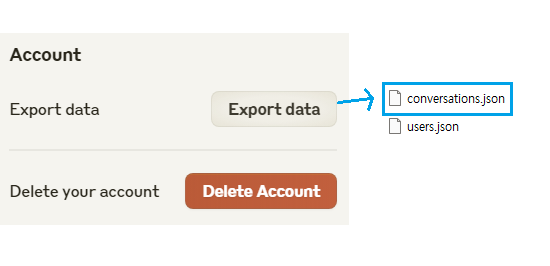
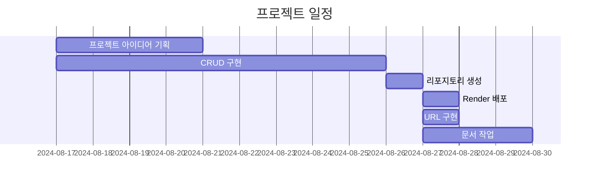
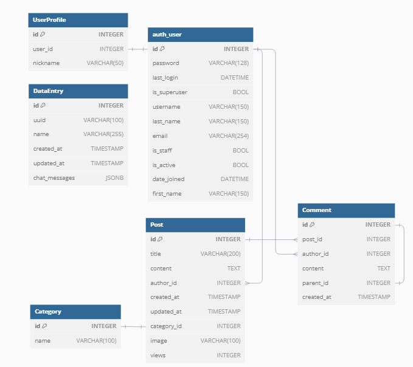

# Claude Export Data Backup Blog ( Unofficial )



Claude에서 'Export Data'로 다운로드받은 conversations.json 파일을 SQLite에 저장하고 Django를 통해 열람 가능한 웹 페이지입니다.

## 배포 URL
[https://claude-export-data-backup-blog.onrender.com/](https://claude-export-data-backup-blog.onrender.com/)

- 테스트용 계정 (로그인해야 작성글 리스트와 메뉴가 화면에 나옵니다)
  ```
  id : test
  pw : !test1234
  ```

## WBS


## URL 구조

- blog

| blog | URL pattern               | Name                 | 기능              |
|------|---------------------------|----------------------|-------------------|
|      | ' '                       | home                 | 메인 페이지        |
|      | blog/                     | post_list            | 게시글 목록        | 
|      | blog/write/               | write_post           | 게시글 작성        | 
|      | blog/<int:pk>/            | post_detail          | 게시글 디테일 페이지  |  
|      | blog/search/<str:tag>/    | search_posts         | 게시글 검색        | 
|      | blog/edit/<int:pk>/       | edit_post            | 게시글 수정        | 
|      | blog/delete/<int:pk>/     | delete_post          | 게시글 삭제        | 
|      | comment/<int:pk>/update/  | comment_update       | 댓글 수정          |
|      | comment/<int:pk>/delete/  | comment_delete       | 댓글 삭제          |

- claude

| claude | URL pattern      | Name        | 기능                            |
|--------|------------------|-------------|---------------------------------|
|        | ' '              | home        | claude 페이지 인덱스             |
|        | upload/          | upload_json | conversations.json 업로드        |
|        | list/            | list_entries| claude 대화 목록                 |  
|        | detail/<int:pk>/ | detail_entry| claude 대화 목록 상세 페이지      | 
|        | delete-all/      | delete_all  | 저장된 claude 대화 목록 전체 삭제 |

- account

| account | URL pattern           | Name                 | 기능            |
|---------|-----------------------|----------------------|----------------|
|         | register/             | register             | 회원 가입         |
|         | login/                | login                | 로그인           | 
|         | password_change/      | password_change      | 비밀번호 변경      | 
|         | password_change/done/ | password_change_done | 비밀번호 변경 완료  | 
|         | profile/              | profile              | 프로필 페이지      | 
|         | profile/update/       | profile_update       | 프로필 수정       |


## ERD




