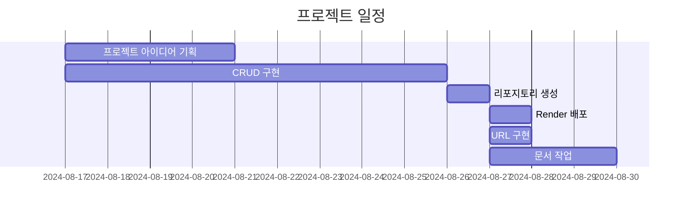

# Claude Export Data Backup Blog ( Unofficial )


Claude에서 'Export Data'로 다운로드받은 conversations.json 파일을 SQLite에 저장하고 Django를 통해 열람 가능한 웹 페이지입니다.

## 배포 URL
[https://claude-export-data-backup-blog.onrender.com/](https://claude-export-data-backup-blog.onrender.com/)

- 테스트용 계정 (로그인해야 작성글 리스트와 메뉴가 화면에 나옵니다)
  ```
  id : test
  pw : !test1234
  ```
  
### Render를 선택한 이유

 1. 무료로 이용 가능하고 이용 기간 제한이 없음

 2. PostgresSQL을 무료로 이용 가능


## WBS


## 구현한 기능

`<account>`

- 사용자의 별명을 저장
- 비밀번호 변경 기능
- 사용자 프로필 조회/업데이트 기능
- LoginRequiredMixin을 사용하여 로그인한 사용자만 접근 가능
- 사용자 계정이 생성될 때 'default'그룹에 포함시키고 기본 프로필을 자동으로 생성

`<blog>`

- 블로그 포스트에 제목, 내용, 작성자, 생성 및 수정 시간, 카테고리, 이미지, 조회수 등의 정보를 포함
- 댓글과 대댓글을 계층적 구조로 구현
- 페이지 기능
- 카테고리별 필터링
- 제목 검색 기능
- 작성일 기준으로 최신순, 오래된 순으로 포스트 정렬

`<claude>`

- Claude AI와의 대화 기록을 저장
- 업로드된 대화 기록 목록을 표시
- 페이지 기능
- UUID, 제목, 생성 및 수정 시간, 대화 메시지 등의 정보를 가독성있게 html로 렌더링

### Django를 통해 구현한 이유

1. Claude JSON의 내용을 DB에 저장하고 대화 내역의 uuid를 비교하여 upsert를 구현

2. Django는 sqlite가 기본 내장되어 간편하게 사용할 수 있어서 타 웹 프레임워크에서 sqlite를 사용하는 경우보다 안정적으로 사용 가능


<details>
<summary><h2> URL 구조 <h2></summary>

- blog

| blog | URL pattern               | Name                 | 기능              |
|------|---------------------------|----------------------|-------------------|
|      | ' '                       | home                 | 메인 페이지        |
|      | blog/                     | post_list            | 게시글 목록        | 
|      | blog/write/               | write_post           | 게시글 작성        | 
|      | blog/<int:pk>/            | post_detail          | 게시글 디테일 페이지  |  
|      | blog/search/<str:tag>/    | search_posts         | 게시글 검색        | 
|      | blog/edit/<int:pk>/       | edit_post            | 게시글 수정        | 
|      | blog/delete/<int:pk>/     | delete_post          | 게시글 삭제        | 
|      | comment/<int:pk>/update/  | comment_update       | 댓글 수정          |
|      | comment/<int:pk>/delete/  | comment_delete       | 댓글 삭제          |

- claude

| claude | URL pattern      | Name        | 기능                            |
|--------|------------------|-------------|---------------------------------|
|        | ' '              | home        | claude 페이지 인덱스             |
|        | upload/          | upload_json | conversations.json 업로드        |
|        | list/            | list_entries| claude 대화 목록                 |  
|        | detail/<int:pk>/ | detail_entry| claude 대화 목록 상세 페이지      | 
|        | delete-all/      | delete_all  | 저장된 claude 대화 목록 전체 삭제 |

- account

| account | URL pattern           | Name                 | 기능            |
|---------|-----------------------|----------------------|----------------|
|         | register/             | register             | 회원 가입         |
|         | login/                | login                | 로그인           | 
|         | password_change/      | password_change      | 비밀번호 변경      | 
|         | password_change/done/ | password_change_done | 비밀번호 변경 완료  | 
|         | profile/              | profile              | 프로필 페이지      | 
|         | profile/update/       | profile_update       | 프로필 수정       |

<<<<<<< HEAD
=======
</details>

## ERD


auth_user 테이블

- Django의 기본 인증 시스템에서 제공하는 사용자 정보를 저장하는 테이블입니다.

UserProfile 테이블

- 사용자의 추가적인 정보를 저장합니다.

Post 테이블

- 블로그 포스트에 대한 정보를 저장합니다.

Comment 테이블

- 각 포스트에 대한 댓글을 저장합니다.

Category 테이블

- 블로그 포스트의 카테고리를 저장합니다.

DataEntry 테이블

- Claude 대화 내역 데이터 백업과 관련된 정보를 저장합니다.


## 후기

- Render에서의 collectstatic 
>>>>>>> 940ec04fbf6457a7d689acf2b7a12465b4933a5d
